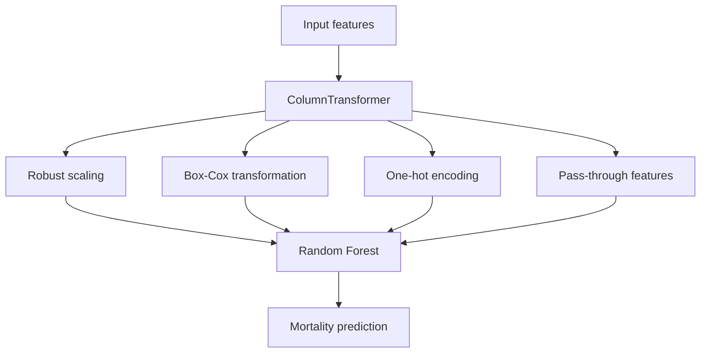

<div align="center">

# SUPPORT2 Clinical Mortality Analysis

An end-to-end notebook workflow for cleaning clinical data, assessing data quality, exploring patient characteristics, and predicting in-hospital mortality with a Random Forest classifier.


</div>

---

## Overview

This project analyses the SUPPORT2 clinical dataset and builds a binary classifier for the `hospdead` outcome, which indicates whether a patient died during hospitalization.

The repository is organized as four notebooks that form one sequential pipeline:

1. clean and standardize the raw data;
2. assess completeness and handle missing values;
3. explore clinical and demographic variables;
4. preprocess features, train a Random Forest model, tune it with stratified cross-validation, and evaluate it on a held-out test set.

The emphasis is not only on model training, but also on documenting data-quality decisions and preventing preprocessing leakage by placing transformations inside a scikit-learn `Pipeline`.

## Project Highlights

| Area | Implementation |
|---|---|
| Dataset size | 9,105 patient records in the original dataset |
| Prediction target | In-hospital mortality (`hospdead`) |
| Data cleaning | Column normalization, sentinel-value replacement, duplicate checks, type coercion, and validity rules |
| Missing-data handling | Median, mode, KNN imputation, selective row removal, and feature exclusion |
| Exploratory analysis | Clinical and demographic visualizations in a dedicated notebook |
| Preprocessing | Robust scaling, Box-Cox transformation, and one-hot encoding |
| Model | Random Forest classifier |
| Validation | Stratified train/test split and 5-fold stratified cross-validation |
| Tuning | `RandomizedSearchCV` over key Random Forest hyperparameters |
| Reported performance | 0.7932 held-out accuracy for the precision-optimized model |
| Additional experiment | 0.7938 probability-based ROC-AUC in the metric-comparison section |

## Dataset

The project uses the [SUPPORT2 dataset from the UCI Machine Learning Repository](https://archive.ics.uci.edu/dataset/880/support2).

According to the UCI dataset page, SUPPORT2 contains records for 9,105 seriously ill hospitalized patients collected across five United States medical centers. The repository uses a selected set of 24 variables covering demographics, physiology, disease information, functional status, resuscitation status, and the mortality target.

The dataset itself is not stored in this repository.

### Required filename

Download the dataset and save the raw CSV in the repository root as:

```text
dataset.csv
```

The notebooks then generate these intermediate files:

| Generated file | Created by | Purpose |
|---|---|---|
| `dataset_clean_tidy.csv` | Notebook 1 | Standardized and validated data |
| `dataset_clean_tidy_filled.csv` | Notebook 2 | Imputed modelling dataset |

## Analysis Workflow


## Notebook Guide

### 1. `1.cleaning_and_tidying.ipynb`

Standardizes column names, missing-value markers, data types, categorical values, and clinical validity constraints.

**Output:** `dataset_clean_tidy.csv`

### 2. `2.data_quality_assess.ipynb`

Measures dataset completeness and applies feature-specific missing-data strategies.

**Output:** `dataset_clean_tidy_filled.csv`

### 3. `3.data_visualization.ipynb`

Explores clinical and demographic distributions, relationships, and mortality patterns through statistical visualizations.

**Output:** rendered plots inside the notebook

### 4. `4.pre_process_and_data_analysis.ipynb`

Builds the preprocessing pipeline, trains the Random Forest classifier, tunes hyperparameters, and evaluates the model.

**Output:** cross-validation results and held-out test metrics

> Run the notebooks in numerical order because each stage depends on files created by the previous stage.

## Data Cleaning

The first notebook performs the following operations:

- converts column names to lowercase;
- replaces spaces and periods in column names with underscores;
- standardizes missing-value markers such as empty strings, `NA`, `NaN`, `unknown`, and `-999`;
- checks for fully duplicated rows;
- strips whitespace and normalizes text to lowercase;
- removes completely empty columns;
- coerces numerical columns to numeric types;
- replaces impossible negative values in selected clinical features;
- validates accepted categories for variables such as sex, race, income, cancer status, and DNR status;
- constrains binary indicators such as diabetes and dementia to `0` or `1`;
- applies basic physiological checks such as positive white-blood-cell count and age below 120.

The cleaned dataset retains 9,105 rows and 24 columns before later missing-data decisions.

## Missing-Data Strategy

Overall completeness before imputation is reported as **94.83%**. Missingness is concentrated mainly in `pafi`, `income`, and `adls`.

| Feature group | Strategy | Reason recorded in the notebook |
|---|---|---|
| `adls` | Drop the feature | High missingness and concern about subjective surrogate reporting |
| `income` | Most-frequent imputation | Nominal categorical feature |
| `pafi` | Median imputation | Right-skewed clinical measurement |
| `age`, `wblc`, `crea`, `meanbp`, `hrt`, `resp`, `temp`, `sod`, `scoma`, `aps` | 5-nearest-neighbour imputation | Preserve multivariate relationships among numerical clinical variables |
| `race` | Remove rows still missing race | Only 42 rows remain missing after the main imputation stage |
| `dnr` | Left partially missing at this stage | Later excluded from the predictive feature set |

After removing rows with missing race, the processed dataset contains **9,063 records**.

## Modelling Pipeline

Before modelling, the analysis removes:

- `dnr`, because it may encode treatment decisions closely related to the outcome;
- `aps`, to avoid relying directly on an aggregate severity score;
- `hday`, because it can introduce timing-related information that may not match the intended prediction setting.

The remaining features are transformed through a `ColumnTransformer`.

| Transformation | Features |
|---|---|
| `RobustScaler` | `temp`, `meanbp`, `hrt`, `resp`, `sod`, `age` |
| Box-Cox `PowerTransformer` | `wblc`, `crea`, `pafi` |
| `OneHotEncoder` | `dzgroup`, `ca`, `race`, `sex`, `income` |
| Pass through | Remaining numerical and binary features |



Keeping preprocessing and classification in one scikit-learn pipeline ensures that each cross-validation fold learns transformations only from its training portion.

## Training and Validation

The modelling notebook uses:

- an 80/20 train/test split;
- `random_state=42`;
- stratification by the mortality target;
- a 5-fold `StratifiedKFold`;
- cross-validation metrics for accuracy, precision, recall, F1, and ROC-AUC;
- a Random Forest baseline with 100 trees;
- `RandomizedSearchCV` with 20 sampled configurations.

The principal hyperparameter search varies:

```python
{
    "classifier__n_estimators": [100, 200, 300],
    "classifier__max_depth": [None, 10, 15, 20],
    "classifier__min_samples_split": [2, 5, 10],
    "classifier__min_samples_leaf": [1, 2, 4],
}
```

The primary search is optimized for precision. The notebook also compares searches optimized for recall, F1, accuracy, and ROC-AUC.

## Recorded Results

| Experiment | Recorded held-out result |
|---|---:|
| Precision-optimized Random Forest | Accuracy: **0.7932** |
| Recall-optimized search | Accuracy: **0.7921** |
| F1-optimized search | Accuracy: **0.7910** |
| Accuracy-optimized search | Accuracy: **0.7871** |
| ROC-AUC-optimized search | Accuracy: **0.7926** |
| ROC-AUC-optimized search | Probability-based ROC-AUC: **0.7938** |

These values are notebook outputs from the current repository version. They should be interpreted as results of this specific split and experiment configuration, not as evidence of clinical validity.

Because the mortality class represents roughly 26% of the dataset, accuracy alone is insufficient. The notebook also uses precision, recall, F1, a confusion matrix, and ROC-AUC to examine minority-class performance.

## Installation

### 1. Clone the repository

```bash
git clone https://github.com/awmiryaw/support2-clinical-mortality-analysis.git
cd support2-clinical-mortality-analysis
```

### 2. Create a virtual environment

```bash
python -m venv .venv
```

Activate it on macOS or Linux:

```bash
source .venv/bin/activate
```

Activate it on Windows PowerShell:

```powershell
.venv\Scripts\Activate.ps1
```

### 3. Install dependencies

```bash
python -m pip install --upgrade pip
pip install -r requirements.txt
```

### 4. Add the dataset

Place the raw SUPPORT2 CSV in the project root and name it:

```text
dataset.csv
```

### 5. Start Jupyter

```bash
jupyter notebook
```

Run notebooks `1` through `4` in order.

## Repository Structure

| Path | Description |
|---|---|
| `1.cleaning_and_tidying.ipynb` | Cleaning, normalization, validity checks, and export |
| `2.data_quality_assess.ipynb` | Completeness analysis and missing-value handling |
| `3.data_visualization.ipynb` | Exploratory data analysis and plots |
| `4.pre_process_and_data_analysis.ipynb` | Preprocessing, model training, tuning, and evaluation |
| `requirements.txt` | Python dependencies |
| `README.md` | Project documentation |
| `dataset.csv` | User-provided raw dataset; not committed |
| `dataset_clean_tidy.csv` | Generated intermediate dataset; not committed |
| `dataset_clean_tidy_filled.csv` | Generated modelling dataset; not committed |

## Reproducibility Notes

- Run the notebooks in numerical order.
- Keep the raw file name exactly as `dataset.csv`.
- The train/test split and cross-validation use `random_state=42`.
- The split is stratified to preserve the target distribution.
- Model preprocessing is contained inside the scikit-learn pipeline.
- Generated CSV files are workflow artifacts and are not currently included in the repository.
- Some notebook cells in the metric-comparison section are not stored with an execution count, although their recorded output is present. Re-run the complete notebook before treating those values as freshly reproduced results.

## Limitations

- Only a Random Forest model family is evaluated.
- The project has no external or temporal validation cohort.
- There is no probability calibration analysis.
- The analysis does not establish clinical usefulness or causal relationships.
- Imputation is fitted during the data-quality notebook before the final train/test split, so the current workflow may expose the modelling stage to information from the complete dataset.
- Fairness across demographic groups is not formally evaluated.
- The repository contains notebooks rather than a packaged training or inference application.
- Results depend on the selected features, cleaning decisions, random split, and hyperparameter search space.

## Possible Next Steps

- move all imputation into the modelling pipeline to eliminate preprocessing leakage;
- compare Random Forest with logistic regression and gradient-boosted trees;
- add calibration curves and decision-threshold analysis;
- report confidence intervals across repeated cross-validation runs;
- evaluate subgroup performance and fairness;
- export the final pipeline with a reproducible training script;
- add automated notebook execution in continuous integration.

## Skills Demonstrated

- clinical-data cleaning and validation;
- missing-data analysis and imputation;
- exploratory data analysis;
- feature transformation;
- scikit-learn pipelines;
- imbalanced binary classification;
- stratified cross-validation;
- randomized hyperparameter search;
- multi-metric model evaluation;
- critical discussion of modelling limitations.

## Data and Medical Disclaimer

The SUPPORT2 dataset is provided by the UCI Machine Learning Repository and remains subject to its own terms and citation requirements.

This repository is for education and portfolio demonstration. Its outputs are not medical advice, and the model has not been validated for clinical deployment.
